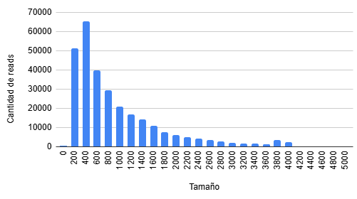
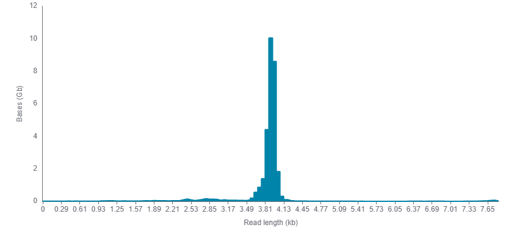

# Trabajo Práctico: Amplicon-seq para detección de isoformas con lecturas largas (ONT)

Marina Luz Ingravidi

maru.luz98@gmail.com

## 1. Introducción

El objetivo de este trabajo práctico es introducir el uso de **secuenciación de lecturas largas (Oxford Nanopore Technologies, ONT)** aplicada a **cDNA-amplicon-seq** para la detección y caracterización de **isoformas transcriptómicas**.

A diferencia de tecnologías de lecturas cortas (Illumina), las lecturas largas permiten observar directamente combinaciones completas de exones dentro de una misma molécula, lo que resulta clave para:

* Identificar isoformas completas
* Detectar eventos de splicing alternativo
* Distinguir isoformas canónicas de isoformas novedosas

Durante el TP se trabajará con datos reales de ONT correspondientes a amplicones del gen ***FMR1***, a partir de dos muestras biológicas (Sample A y Sample B) con un conjunto parcialmente compartido de isoformas. Las muestras fueron tomadas de sangre y células de granulosa ovárica de mujeres.

Contexto:
El gen ***FMR1*** (ENSG00000102081), localizado en el cromosoma X, codifica la proteína **FMRP** y está involucrado en cuatro trastornos genéticos. A través del *splicing alternativo* de su ARNm, el transcripto puede generar numerosas isoformas, lo que sugiere que cada una podría tener un rol celular específico. Con todos sus exones, sin ningún intrón, y desde el sitio de inicio de la traducción y hasta el sitio de *stop*, el mensajero de ***FMR1*** mide aproximaadmente 3,8 kpb. Los *primers* fueron diseñados para hibridar algunos pb rio arriba del ATG y algunos pb rio abajo del *stop*, por lo que un amplicón del mensajero completo mide un poco más de 3,9 kpb.

En el laboratorio nos interesa la **Insuficiencia ovárica primaria asociada a la fragilidad del X (FXPOI)** y el patrón de expresión de las isoformas en tejido ovárico. En estudios previos, identificamos varias isoformas durante la foliculogénesis en el ovario de rata, pero debido al diseño experimental no pudimos detectar todas las isoformas potencialmente expresadas. De manera similar, no existen estudios en tejidos humanos que describan todas las isoformas expresadas y sus secuencias completas. Por lo tanto, como objetivo, buscamos optimizar la detección de isoformas mediante secuenciación de lecturas largas con tecnología **Oxford Nanopore Technologies (ONT)** en sangre y células de granulosa de mujeres enroladas en un protocolo de ovodonación (no portadoras de la premutación ni la mutación de ***FMR1***). Este enfoque permite secuenciar los transcriptos completos con alta sensibilidad, lo que nos brinda la posibilidad de identificar isoformas nuevas.

---

## 2. Objetivos del trabajo práctico

Al finalizar el TP, se espera que el/la estudiante sea capaz de:

* Comprender el flujo general de análisis de datos de amplicon-seq con ONT
* Alinear lecturas largas contra un genoma de referencia
* Interpretar métricas básicas de alineamiento
* Inferir isoformas transcriptómicas utilizando el pipeline de **FLAIR**
* Comparar isoformas detectadas entre dos muestras
* Visualizar alineamientos e isoformas en un navegador genómico (IGV)
* Entender por qué las lecturas largas exceden las capacidades de tecnologías de lecturas cortas para este tipo de análisis

---

## Arrancamos:

## 3. Organización del directorio de trabajo

La carpeta `/media/libre/datos_genomica/14_TP_RNAseq_largas/Maru/clase-amplicon-seq/` contiene varios archivos. Los que usaremos para el TP son:

```text
Homo_sapiens.GRCh38.115.gtf.gz
Homo_sapiens.GRCh38.dna.primary_assembly.fa.gz
sample_A.fastq
sample_B.fastq
```

### Sugrencia:
Crear carpetas para los *outputs* de cada comando (lo iremos mencionado en cada paso)

---

## 4. Archivos de referencia

### Genoma

Se utiliza el genoma humano **GRCh38 (Ensembl release 115)**:

* Archivo FASTA: `Homo_sapiens.GRCh38.dna.primary_assembly.fa.gz`

Descomprimir el genoma:

```bash
gunzip Homo_sapiens.GRCh38.dna.primary_assembly.fa.gz
```

### Anotaciones

* Archivo GTF: `Homo_sapiens.GRCh38.115.gtf.gz`

Este archivo contiene las anotaciones génicas y transcriptómicas utilizadas por FLAIR para corregir y colapsar isoformas.

Descomprimir el gtf:

```bash
gunzip Homo_sapiens.GRCh38.115.gtf.gz
```

Estructura del gtf: Cada línea representa una característica (ej. exón, CDS, codón de inicio) con 9 columnas.
Columnas:
* seqname: Nombre del cromosoma o scaffold.
* source: Fuente de la anotación.
* feature: Tipo de característica (ej. gene, transcript, exon, CDS, UTR).
* start: Inicio de la característica.
* end: Fin de la característica.
* score: Valor numérico o punto.
* strand: Hebra (+ o -).
* frame: Marco de lectura (0, 1, 2).
* attributes: Lista de pares clave-valor (ej. gene_id "..."; transcript_id "...")

---

DISCLAIMER:

## Control de calidad (QC) de lecturas ONT (paso previo al análisis)

Antes de iniciar cualquier análisis de datos de secuenciación, es fundamental realizar un **control de calidad (Quality Control, QC)** de las lecturas crudas.

En el caso de datos de **Oxford Nanopore Technologies (ONT)**, el QC suele enfocarse principalmente en:

- **Distribución de longitudes de las lecturas**
- **Calidad promedio por lectura (Q-score)**
- **Identificación de lecturas truncadas o artefactos**

Herramientas comúnmente utilizadas para este paso incluyen, por ejemplo, `NanoPlot`, `NanoQC` o herramientas similares.

### Ejemplos de distribuciones de longitudes

A continuación se muestran ejemplos ilustrativos de histogramas de longitudes de lecturas ONT:

#### Ejemplo 1: muchas lecturas cortas
Este patrón suele indicar:
- Fragmentación del cDNA
- Problemas en la preparación de la biblioteca
- Reads incompletas





#### Ejemplo 2: lecturas del tamaño esperado
Este patrón es el esperado para un experimento de amplicon-seq bien controlado, donde la mayoría de las lecturas tienen una longitud cercana al tamaño del amplicón.





### Filtrado por calidad y longitud

En un pipeline completo, luego del QC se puede aplicar un **filtrado de lecturas**, por ejemplo:

- Eliminar lecturas por debajo de un Q-score mínimo
- Eliminar lecturas demasiado cortas o demasiado largas respecto al tamaño esperado del amplicón

Este paso permite mejorar la calidad del alineamiento y la detección de isoformas.

### Nota para este trabajo práctico

En este TP **no se realizará el paso de QC ni filtrado**, ya que estos conceptos y herramientas fueron abordados previamente en la materia.

Para este ejercicio se trabajará directamente con lecturas ya seleccionadas, con el objetivo de focalizarse en:

- Alineamiento contra el genoma
- Detección de isoformas
- Comparación entre muestras


## 5. Alineamiento de lecturas contra el genoma

### ¿Por qué alinear contra el genoma y no contra el transcriptoma?

* Permite detectar isoformas no anotadas
* Evita sesgos introducidos por anotaciones incompletas
* Es un paso necesario para pipelines de detección de isoformas como FLAIR

### Indexado del genoma

El indexado del genoma con **minimap2** consiste en generar una estructura de datos que permite acelerar el alineamiento. 

```bash
minimap2 \
-d Homo_sapiens.GRCh38.dna.primary_assembly.mmi \
Homo_sapiens.GRCh38.dna.primary_assembly.fa
```


### Alineamiento de lecturas

> Sugerencia: crear la carpeta `alineamientos` y guardar allí los resultados de los alineamientos.

```bash
mkdir alineamientos
```

Las lecturas ONT se alinean utilizando parámetros *splice-aware*:

```bash
minimap2 \
-ax splice \
Homo_sapiens.GRCh38.dna.primary_assembly.mmi \
sample_A.fastq \
--splice-flank yes \
-o alineamientos/sample_A.sam
```

El mismo procedimiento se repite para `sample_B.fastq`.
```bash
minimap2 \
-ax splice \
Homo_sapiens.GRCh38.dna.primary_assembly.mmi \
sample_B.fastq \
--splice-flank yes \
-o alineamientos/sample_B.sam
```
---

**Explicación de los argumentos:**
`-ax splice`: Este comando indica que estamos alineando RNA (cDNA) contra un genoma por lo que van a existir saltos o gaps grandes en el alineamiento que son posibles intrones. Entonces el algoritmo permite gaps largos (intrones) y modela señales de splicing (sitios dadores y aceptores GT-AG)

`Homo_sapiens.GRCh38.dna.primary_assembly.mmi`: Índice del genoma contra el cual se alinean las lecturas

`sample_X.fastq`: Lecturas filtradas listas para ser alineadas

`--splice-flank yes`: Hace que minimap2 considere una base adicional alrededor de los siios de splicing que se sabe que está muy conservada para tener una señal un poco más específica y mejorar la precisión del sitio exacto del splicing (para humanos, para otras especies leer bibliografía)

`-o alineamientos/sample_X.sam`: Le indico a minimap2 dónde guadar el archivo de salida (en la carpeta `alineamientos` que creamos previamente) y cómo se va a llamar el archivo (`sample_X.sam`)


**Archivos de salida:** `sample_A.sam` y `sample_B.sam` (RECUERDEN: están dentro de la carpeta alineamientos/)

**Explicación de los archivos de salida:**
`sample_X.sam`: Es un archivo de alineamientos (SAM = Sequence Aligment Map) que contiene dos secciones: encabezado y alineamientos. El encabezado incluye metadata del archivo (lecturas), de las referencias, etc. Los alineamientos indican el nombre de la lectura alineada, la secuencia de la lectura, la calidad del mapeo, etc.


## 6. Evaluación del alineamiento

Se utilizan herramientas de **samtools** para evaluar la calidad del alineamiento (recuerden que para correr el código así como esta tienen que estar parados en la carpeta alineamientos):

```bash
samtools flagstat sample_A.sam
```

```bash
samtools flagstat sample_B.sam
```
> Sugerencia: se puede guardar la salida del resumen de la siguiente manera: `samtools flagstat sample_A.sam > flagstat_sample_A.txt`

Este comando resume:

* Número total de lecturas
* Porcentaje de lecturas alineadas
* Lecturas correctamente pareadas (si aplica)

> Discutir en clase qué significa cada métrica y qué se espera en datos de amplicon-seq.

---

## 7. Conversión y procesamiento de formatos

Recuerden que para correr el código así como esta tienen que estar parados en la carpeta alineamientos):

### SAM → BAM ordenado (*sorted*)

```bash
samtools view -bS sample_A.sam | samtools sort -o sample_A.sorted.bam
```

```bash
samtools view -bS sample_B.sam | samtools sort -o sample_B.sorted.bam
```

> Los archivos BAM representan lo mismo que los SAM pero de manera comprimida, BAM = Binary Aligment Map.
Ordenar el BAM significa ordenar los alineamientos por las coordenadas de las lecturas. De esta manera, las lecturas que se alinearon con el comienzo del cromosoma 1 serán las primeras en aparecer en el BAM ordenado (sorted)


### Indexado del BAM

```bash
samtools index sample_A.sorted.bam
```

```bash
samtools index sample_B.sorted.bam
```

> El indexado es similar en concepto al indexado del genoma.

### Conversión a BED12

```bash
bamToBed -bed12 -i sample_A.sorted.bam > sample_A.bed
```

```bash
bamToBed -bed12 -i sample_B.sorted.bam > sample_B.bed
```

> El formato BED12 es requerido por FLAIR y representa explícitamente la estructura exon–intrón de cada lectura. Pueden visualizar el archivo con el comando `less` (para recorrer el archivo usar ENTER o la ruedita del mouse, para salir del archivo CTRL + Z). Las columnas son:
>* chrom: Nombre del cromosoma o scaffold
>* chromStart: Posición de inicio
>* chromEnd: Posición final
>* name: Nombre del alineamiento/lectura
>* score: Puntuación de 0 a 1000
>* strand: Orientación ('+' o '-').
>* thickStart: En general, inicio de la región codificante (CDS).
>* thickEnd: En general, fin de la región codificante (CDS).
>* itemRgb: Color de visualización (RGB).
>* blockCount: Número de bloques (exones).
>* blockSizes: Tamaños de los bloques separados por comas.
>* blockStarts: Inicios de los bloques relativos a chromStart. 

---

## 8. Detección de isoformas con FLAIR

### FLAIR correct

Corrige los alineamientos utilizando anotaciones conocidas:

> Sugerencia: crear la carpeta `correct`,  guardar allí los resultados de este paso y correr los comandos desde la carpeta clase-amplicon-seq/ (ya que ahí están los archivos sample_X.fastq).

```bash
flair correct \
--query alinemientos/sample_A.bed \
--gtf Homo_sapiens.GRCh38.115.gtf \
--output correct/sample_A
```

```bash
flair correct \
--query alinemientos/sample_B.bed \
--gtf Homo_sapiens.GRCh38.115.gtf \
--output correct/sample_B
```

**Explicación de los argumentos:**

`--query` y `--gtf`: se usan para comparar entre sí. Si en el BED aparece un sitio de splicing en un posición no descripta en el gtf de referencia, ese alineamiento se descarta. Si tuviéramos lecturas cortas del mismo tejido podríamos usarlas para ajustar los sitios de splicing usando esas lecturas como referencia. 

**Archivos de salida (no necesariamente devuelve todos):** `sample_X_all_corrected.bed`, `sample_X_all_inconsistent.bed`, `sample_X_cannot_verify.bed`.

**Explicación de los archivos de salida:**

`sample_X_all_corrected.bed`: archivo BED con las posociones de los sitios de splicing corregidas

`sample_X_all_inconsistent.bed`: alineamientos rechazados por tener sitios de splicing no despcriptos en el gtf

`sample_X_cannot_verify.bed`: solo lo devuelve si hay alineamientos en un cromosoma que no se encuentra en la anotación (gtf)

### FLAIR collapse

> Sugerencia: crear la carpeta `collapse`, guardar allí los resultados de este paso y correr los comandos desde la carpeta clase-amplicon-seq/ (ya que desde ahí llamaremos a los archivos necesarios).

Este paso lee todas las lecturas corregidas (del paso anterior), detecta lecturas con la misma estructura exon-intron, agrupa esas lecturas en una sola isoforma y genera una representación de cada isoforma.

Como tenemos múltiples muestras (2), concatenamos las lecturas del .bed generadas en el paso anterior (solo las `all corrected`):

```bash
cat \
correct/sample_A_all_corrected.bed \
correct/sample_B_all_corrected.bed \
> correct/sample_A_B_all_corrected.bed
```

Luego usamos ese archivo `.bed` concatenado para agruparlas en isoformas únicas:

```bash
flair collapse \
-g Homo_sapiens.GRCh38.dna.primary_assembly.fa \
--gtf Homo_sapiens.GRCh38.115.gtf \
-q correct/sample_A_B_all_corrected.bed \
-r sample_A.fastq sample_B.fastq \
--output collapse/sample_A_B \
--stringent \
--check_splice \
--generate_map
```

**Explicación de los argumentos:**

`--gtf Homo_sapiens.GRCh38.115.gtf` y `-q sample_A_B_all_corrected.bed`: El BED corregido del paso anterior se usa para comparar conra este gtf y establecer si el alineamiento corresponde a una isoforma anotada o no. Recuerden que solo va a reconocer y agrupar lecturas que tengan sitios de splicing (canónicos o alternativos) anotados y combinaciones de esos sitios de splicing.

`-g Homo_sapiens.GRCh38.dna.primary_assembly.fa`: Se usa para generar el archivo de secuencias .fa de las isoformas generadas.

`-r sample_X.fastq`: Sirve para múltiples comparaciones que se hacen en el proceso decolapso de isoformas.

`--output collapse/sample_A_B`: Carpeta donde guardar los archivos de salida y nombre de base para todos los archivos de salida.

`--check_splice`: Exige que un sitio de splicing tenga al menos 4 pb de 6 cubiertos por una lectura para que esa lectura sea contada como soporte de esa isoforma.

`--stringent`: Exige que cada lectura cubra al menos 25pb del primer y último exón y que cubra al menos el 80% de la isoforma.

`--generate_map`: Para cada isoforma indica qué lecturas la respaldan.

**Archivos de salida:** `sample_A_B.isoforms.bed`, `sample_A_B.isoforms.gtf`, `sample_A_B.isoforms.fa`

**Explicación de los archivos de salida:**

`sample_A_B.isoforms.bed`: Archivo BED que representa explícitamente la estructura exon–intrón de cada isoforma (NO LECTURAS).

`sample_A_B.isoforms.gtf`: Archivo gtf (ver más arriba para recordar qué contiene un archivo gtf).

`sample_A_B.isoforms.fa`: Archivo fasta donde se incluyen las secuencia de cada isoforma colapsada. 


### FLAIR quantify

> Sugerencia: crear la carpeta `quantify`, guardar allí los resultados de este paso y correr los comandos desde la carpeta clase-amplicon-seq/ (ya que desde ahí llamaremos a los archivos necesarios).

Cuantifica la abundancia de isoformas. Primero necesitamos crear un archivo .tsv (separado por tabulaciones) que contenga la siguiente información:
muestra    condición    batch    ruta/a/las/lecturas/originales

IMPORTANTE: no usar guiones bajos en las primeras columnas del archivo!!!

Como en este caso estamos trabajando con las dos muestras juntas, creamos un solo reads_manifest.tsv. Puden poner el nombre que deseen en muestra, condición y batch, mientras respeten la ruta hacia las lecturas para cada muestra.

Ejemplo de cómo debería quedar el archivo:

`sample  A  1  /media/libre/datos_genomica/14_TP_RNAseq_largas/Maru/clase-amplicon-seq/sample_A.fastq`

`sample  B  1  /media/libre/datos_genomica/14_TP_RNAseq_largas/Maru/clase-amplicon-seq/sample_B.fastq`


> Pueden crearlo desde el Notepad o abriendo un archivo de texto con el comando:
> ```bash
> nano
> ```
> 
> Para guardar el archivo y ponerle un nombre, leer la parte inferior del archivo abierto en nano (recuerden que el símbolo ^ indica que hay que apretar la tecla CTRL). 
 
Una vez tengamos el `reads manifest` cuantificamos:

```bash
flair quantify \
-r reads_manifest_A_B.tsv \
-i collapse/sample_A_B.isoforms.fa \
--output quantify/sample_A_B
```

**Explicación de los argumentos:**

`-r reads_manifest_A_B.tsv`: Archivo que asigna a cada fastq de las lecturas originales un nombre y, si hubiera, las condiciones/tratamientos y batch de cada muestra. En nuestro caso solo nos interesa la condición de cada muestra (sample), A y B.

`-i collapse/sample_A_B.isoforms.fa`: Archivo con las secuencias de las isoformas colapsadas para remapear y poder establcer qué lecturas respaldan a cada isoforma.

`--output quantify/sample_A_B`: Carpeta donde guardar los archivos de salida y nombre de base para todos los archivos de salida.

**Archivos de salida:** `sample_AB_B.counts.tsv`

**Explicación de los archivos de salida:**

`sample_AB_B.counts.tsv`: Una tabla separada por tabulaciones cuyas columnas son las muestras y las filas son las isoformas halladas con la cantidad de lecturas asociadas a cada isoforma en cada muestra. 

---

## 9. Visualización en IGV e IsoVis

Los archivos `*.sorted.bam` + `*.bai`, `*.bed` y `*.gtf`, junto con el genoma usado para este flujo de trabajo pueden cargarse en **IGV** para:

* Visualizar alineamientos individuales (visualizar los alineamientos del paso de alineamientos)
* Observar estructuras de exones (visualizar el gtf de las isoformas generadas en el paso de collapse)
* Comparar isoformas entre Sample A y Sample B

Para este TP lo haremos online, pero IGV también puede usarse de manera local descargando el programa.
Se recomienda navegar a la región del gen ***FMR1*** y discutir diferencias observadas entre las muestras.

Otra forma de visualizar solo las isformas colapsadas es con el software online IsoVis (`https://isomix.org/isovis/`)

Para determinar qué sitios de slicing se están utilizando se puede ver con estas herramientas o esquematizar las isoformas con distintos paquetes de R como `ggtranscript`.

Se les deja como tarea la visualización y, si desean, la esquematización.

---

## 10. Discusión y preguntas

1. ¿Qué isoformas están presentes en ambas muestras?
2. ¿Se detectan isoformas exclusivas de alguna muestra?
3. ¿Qué ventajas ofrece ONT frente a lecturas cortas para este análisis?
4. ¿Qué limitaciones tiene el enfoque de amplicon-seq?

---

## 11. Conclusión

Con este flujo de trabajo logramos identificar qué isoformas del gen FMR1 están presentes en cada muestra y cuantas lecturas de cada una hay en cada muestra. También pudimos determinar cuáles isoformas estaban descriptas y cuáles contenían nuevas combinaciones de splicing.
Este TP muestra cómo el uso de lecturas largas permite una caracterización más precisa del transcriptoma, destacando el potencial de ONT para estudios de isoformas que no pueden resolverse adecuadamente con tecnologías de lecturas cortas. Existen otras herramientas que permiten hacer el mismo análisis y alentamos a que las prueben y comparen su performance contra las que usamos en este TP.

Cualquier duda que tengan me escriben al mail que está arriba de todo!
